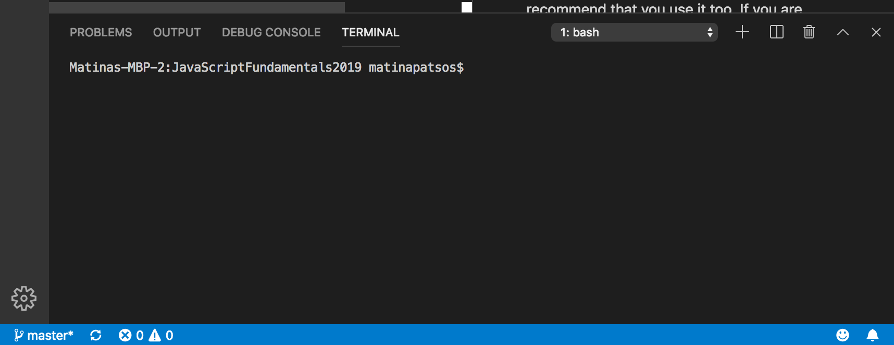
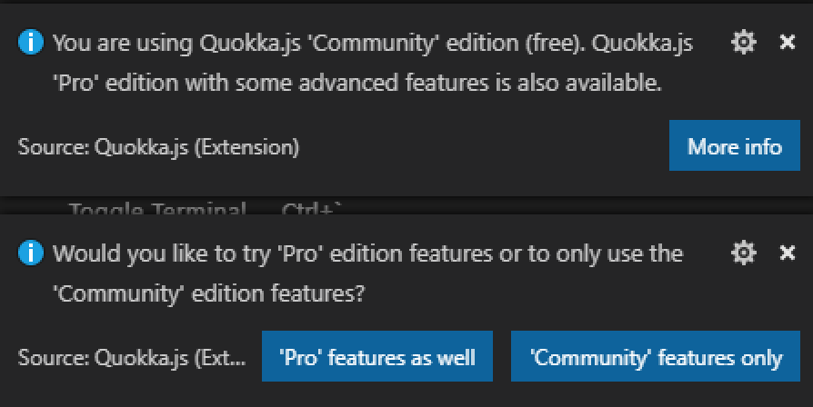

# Installation Guide - Mac

## What You Will Be Installing

1. Microsoft Teams
2. Slack
3. Xcode
4. Homebrew
5. Git
6. Node.js (latest) and NPM Packages
7. Visual Studio Code (Recommended) and Plugins
8. Chrome or Firefox (Recommended)

We are going to install software over the command line, so before starting, open your terminal window. (You can open it by pressing `command+space` and searching for _terminal_).

## Microsoft Teams

Before class began, you should have received emails and training from AlbanyCanCode about on how to install, setup, and use Microsoft Teams.

## Slack

Before installing Slack, please accept the invite to AlbanyCanCode's channel (_albanycancode_). You should have received an email before class.

Use can use the [web](https://slack.com/get-started?email_first=1#/signin) or desktop version. The desktop version can be found in the App Store.

## Xcode

Xcode can be found in the App Store. It will take around 50 minutes to install, so please install ASAP.

## Homebrew

[Homebrew](https://brew.sh/) is a package manager for Mac, meaning that it will help make installing and managing a lot of command line software easier. We will be installing Node.js with Homebrew to avoid permission issues.

If you already have Homebrew installed or if you are not sure whether you have it installed, type `brew -v` in your terminal. If you see a response like _Homebrew 2.4.16_, then you have it installed. Update homebrew with `brew update` and then you can skip ahead to the next section. If you get a _command not found_ error, you will need to install Homebrew.

To install Homebrew, type this in your terminal:

```bash
/bin/bash -c "$(curl -fsSL https://raw.githubusercontent.com/Homebrew/install/master/install.sh)"
```

Hit enter when the installation prompts you to hit enter. At some point, you may be requested to enter your password. The password is the same password you use to login with your computer.

Once installed, type `brew -v` to confirm that everything worked. As a safe measure, type `brew doctor`. You should see _Your system is ready to brew_.

Type `echo $PATH`. Make sure that _/usr/local/bin_ is somewhere in the response. If it is not, then type:

```bash
export PATH="/usr/local/bin:$PATH"
```

## Git

Git is version control software. It is used for sharing code, combining team members' code and managing different versions of your code.

If you are not sure whether you have it installed, type `git --version` in your terminal. If you see output like this - _git version 2.28.0_ - then congratulations! You already have git installed and you can skip ahead to the next section.

To install git, type this in your terminal:

```bash
brew install git
```

When it's finished, type `git --version` to confirm that it has installed.

## Node.js and NPM Packages

Node.js is a JavaScript runtime engine. Basically, it allows you to run JavaScript programs outside of the browser.

You will need to have the latest stable version of Node installed as of September 2020 (14.9). If you already have Node.js installed, type `node -v`. If you do not have the latest version, you can do one of the following to things:

1. [Upgrade Node.js with using whatever you installed Node.js with.](https://flaviocopes.com/how-to-update-node/) If you have Node.js projects on your computer and you wish to maintain them, this could break your existing projects.
2. Install multiple version of Node.js on your computer with NVM. See the _Node Version Manager (NVM)_ section of the [Linux Installaton Guide](InstallationGuideLinuxAndNVM.md).

You should also update NPM. You can update it with:

```bash
npm install -g npm@latest
```

If you do not have Node.js installed, type this is your terminal:

```bash
brew install node
```

When it’s finished, type `node -v` to confirm that it has installed.

### ESLint

ESLint is a linter, meaning that it will point out potential errors while you are typing in a code editor like Visual Studio Code, Atom or Sublime.

To install ESLint, type:

```bash
npm install -g eslint
```

When it’s finished, type `eslint -v` in your terminal to confirm it has installed.

## Visual Studio Code (Recommended) and Plugins

Visual Studio Code is an IDE, which is an intelligent code editor. We will be teaching with Visual Studio Code and highly recommend that you use it too. If you are experienced with programming and command line, and you believe that you can translate whatever we teach you in Visual Studio Code to your editor of choice, you may opt for another editor, but we will not be able to help you if problems arise.

To install, go to https://code.visualstudio.com and click on _Download for Mac_.

When it finishes downloading, double click on the downloaded ZIP file and move Visual Studio Code from your Downloads folder to your Applications folder. You many need to enter your password.

Open Visual Studio Code.

### Adding Visual Studio Code to Your Path Variable

You should configure your computer so that you can open Visual Studio Code via the terminal. Press `command+shift+p`, search for _shell command_ and click on _Shell Command: Install 'code' command in PATH_.


### Configuring Git to Open in Visual Studio Code

You should have a terminal open in the bottom panel of the screen like this. (If you do not, press `control+ ~` to open it).



Click on it and enter the following:

```bash
git config --global core.editor "code --wait"
git config --global -e
```

Restart Visual Studio Code.

### ESLint Extension

Open the Extensions tab on the left, search for _ESLint_ and install _ESLint_.


Once its installed, the _Install_ button may have transformed into a _Reload_ button. If you see _Reload_, click on it.

### Quokka.js

[Quokka.js](https://quokkajs.com/docs/?editor=vsc) is a sandbox that lets you play with JavaScript inside Visual Studio Code and other popular code editors. Search for _Quokka_ in the Extensions tab on the left and install _Quokka.js_. Once its installed, click on _Reload_ if necessary.

If Quokka prompts you to go Pro, select _'Community' features only_.



### Prettier Extension (Optional)

Prettier automatically formats your code and you can configure it to format your code whenever you save a file. Using this is optional for now but we will require it for group projects.

If you would like to use prettier, search for _Prettier_ in the Extensions tab on the left and install _Prettier - Code formatter_. Once its installed, click on _Reload_ if necessary.

You can now adjust Visual Studio's settings so that it will format on save and will play nicely with Prettier's defaults. Press `command+shift+p,` search for _settings_ and click on _Preferences: Open Settings (JSON))_.


Paste the following into the JSON file. Do not overwrite any settings that you already have.

```json
  "editor.formatOnSave": true,
  "editor.insertSpaces": true,
  "editor.tabSize": 2,
```

## Chrome or Firefox (Recommended)

You should use any modern browser that has good Developer Tools available. (In other words, not Internet Explorer). We recommend Chrome because we will be demonstrating Chrome's tools in class. Firefox is also a great choice.

- [Chrome](https://www.google.com/chrome/)
- [FirefoxDeveloperEdition](https://www.mozilla.org/en-US/firefox/developer/)
- [Firefox](https://www.mozilla.org/en-US/firefox/)
